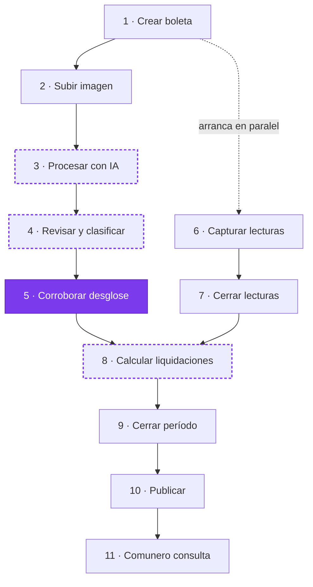
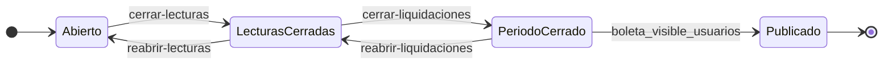

# Flujo del período mensual

Desde que llega la boleta de la compañía hasta que el comunero ve su liquidación.

Dos frentes avanzan en paralelo — el administrador arma el desglose, el lector recorre los remarcadores — y convergen en el cálculo.

> **Estado de este documento:** refleja el flujo **con el cambio `items-credito-y-validacion` aplicado**. Los pasos marcados como nuevos todavía no están implementados; ver [openspec/changes/items-credito-y-validacion/](../openspec/changes/items-credito-y-validacion/).

---

## Vista general



Morado sólido = paso nuevo. Borde punteado = paso existente que cambia.

---

## Estados de la boleta

| Estado | Significado |
|--------|-------------|
| `borrador` | Recién creada, o devuelta tras un cambio en las cifras. No se puede calcular. |
| `validada` | **Nuevo.** El administrador corroboró qué entra al reparto. Habilita el cálculo. |
| `publicada` | Visible para los comuneros. Punto sin retorno. |

Los tres candados del período son ortogonales al estado y avanzan en su propio orden:



`validada` estaba declarado en el modelo desde el diseño original y nunca se asignaba. Este cambio lo pone en uso.

---

## Antes del primer período — la lectura inicial

### 0. Lectura inicial de los medidores

```
POST /api/v1/boletas/lectura-inicial      {periodo_mes: "2026-03-01"}
```

Solo en un condominio **sin boletas**. Abre un período especial (`tipo = lectura_inicial`), sin boleta de la compañía, con una lectura en blanco por parcela: su único fin es registrar la **lectura de partida** de cada medidor. Sin ella, la primera boleta cobraría a cada comunero el número completo de su medidor.

- El lector la toma con la app, igual que una lectura mensual (sin señal, con foto). Conviene hacerlo **el mismo día en que la compañía lee el medidor general**: desde ahí corre el primer período.
- La administración puede ingresarla o corregirla en la pestaña *Lecturas*, una a una o **de forma masiva desde Excel**: **Descargar plantilla** (Parcela, Propietario, Lectura inicial), completarla y **Cargar desde Excel**. Se ve una vista previa (a aplicar, reemplazos, vacías y errores por fila) y solo se aplica si no hay errores (`GET /boletas/{id}/lecturas-iniciales/plantilla`, `POST /boletas/{id}/lecturas-iniciales/importar?aplicar=`, auditoría `IMPORTAR_LECTURAS_INICIALES`).
- Se cierra con **Cerrar lecturas**. Cerrada, deja crear la primera boleta, que toma el mes siguiente y parte de estos valores como lectura anterior.
- No se liquida ni se publica: calcular, corroborar, subir imagen, OCR, editar ítems, cerrar liquidaciones o publicar responden `409` «El período de lectura inicial no se liquida».
- No se puede reabrir si ya existe un período posterior (que tomó sus lecturas como base).

| Código | Motivo |
|--------|--------|
| `409` | El condominio ya tiene períodos. |

Auditoría: `CREATE_LECTURA_INICIAL`

## Administrador — el desglose

### 1. Crear la boleta del período

```
POST /api/v1/boletas/
```

Nace en `borrador`. El sistema genera una lectura en blanco por cada parcela arrastrando la lectura anterior, y copia los ítems del mes pasado en $0 conservando su clasificación.

Esa clasificación heredada es una **propuesta**, no una decisión tomada: el administrador la corrobora o la cambia cada mes.

**Sin ceros silenciosos:** si alguna parcela activa no tiene ninguna lectura previa, responde `409` con `{codigo: "sin_lectura_anterior", parcelas: [...]}` y no crea nada. Solo se crea si se envía `aceptar_sin_lectura_anterior: true`; esas parcelas parten en 0 y su lectura anterior se puede ingresar luego en la pestaña *Lecturas* (es la única lectura anterior editable: la de una parcela con historial viene del período anterior y `PATCH /lecturas/{id}` la rechaza con `409`).

| Código | Motivo |
|--------|--------|
| `409` | Ya existe otro período del condominio sin cerrar (o la lectura inicial tiene las lecturas abiertas). |
| `409` | Hay parcelas activas sin lectura anterior y no se aceptó explícitamente. |

Auditoría: `UPLOAD_BOLETA`

### 2. Subir la imagen de la boleta

```
POST /api/v1/boletas/{id}/imagen
```

JPG, PNG, WEBP, HEIC o PDF. Se puede reemplazar en cualquier momento, incluso con el período cerrado.

| Código | Motivo |
|--------|--------|
| `422` | Formato de archivo no soportado. |

Auditoría: `UPLOAD_IMAGEN_BOLETA`

### 3. Procesar con IA — *cambia*

```
POST /api/v1/boletas/{id}/procesar-ocr
```

Gemini Vision lee totales e ítems. Cada línea se empareja por similitud contra los ítems existentes; si supera el umbral de 0,6 actualiza el monto aplicándole el 19% de IVA.

**Lo que cambia:**

- Las líneas sin coincidencia ya no se descartan en silencio: se crean como ítems `pendiente`.
- Los descuentos y notas de crédito llegan con **signo negativo** en vez de valor absoluto.
- Si la boleta estaba en `validada`, vuelve a `borrador`.

| Código | Motivo |
|--------|--------|
| `400` | La boleta todavía no tiene imagen subida. |
| `404` | El archivo físico no está en el servidor. |
| `409` | El período ya está cerrado. |
| `422` | Gemini falló, devolvió algo no interpretable, o la cuota está agotada. |

Auditoría: `PROCESS_OCR`

### 4. Revisar y clasificar el desglose — *cambia*

```
PUT /api/v1/boletas/{id}/detalles
```

El administrador corrige totales y decide, ítem por ítem, qué tratamiento recibe. Aquí se resuelven los `pendiente` que dejó el OCR.

**Lo que cambia:** si la boleta estaba en `validada`, vuelve a `borrador`.

| Código | Motivo |
|--------|--------|
| `409` | El período ya está cerrado. |

Auditoría: `UPDATE_DETALLES_BOLETA`

### 5. Corroborar el desglose — *nuevo*

```
POST /api/v1/boletas/{id}/validar-items
```

El acto formal por el que el administrador declara qué entra al reparto de este período. La boleta pasa de `borrador` a `validada`.

Queda registrada en auditoría una **instantánea completa** del desglose: cada ítem, su monto, su clasificación, más los totales de la boleta. Si en seis meses alguien cuestiona por qué un cargo entró o no, el registro lo demuestra.

Es obligatorio todos los meses, aunque nada haya cambiado respecto del anterior.

| Código | Motivo |
|--------|--------|
| `409` | Quedan ítems sin clasificar — el mensaje indica cuántos. |
| `409` | El desglose ya fue corroborado. |
| `409` | El período ya está cerrado. |

Auditoría: `VALIDAR_ITEMS` + instantánea

---

## Lector — los remarcadores

Arranca en paralelo desde el paso 1.

### 6. Capturar las lecturas en terreno

```
POST  /api/v1/lecturas/
PATCH /api/v1/lecturas/{id}
POST  /api/v1/lecturas/sincronizar      (lecturas tomadas sin señal)
PUT   /api/v1/lecturas/{id}/foto        (foto del medidor)
GET   /api/v1/lecturas/{id}/foto
```

Vista móvil con las parcelas activas pendientes y una barra de avance. El consumo se calcula como la diferencia con la lectura anterior. Una parcela cuenta como leída cuando su lectura tiene `fecha_toma`. Funciona sin señal: ver [lecturas-sin-conexion.md](lecturas-sin-conexion.md).

El lector puede tomar una **foto del medidor** (opcional) junto a cada lectura; queda amarrada a esa toma y la administración la ve en la pestaña *Lecturas* del período. Corregir después el valor no borra la foto: es la evidencia de la corrección. El comunero ve la foto de su medidor cuando el período se publica.

| Código | Motivo |
|--------|--------|
| `422` | La lectura actual no puede ser menor que la anterior. |
| `409` | Las lecturas del período ya están cerradas. |

Auditoría: `CREATE_LECTURA` / `UPDATE_LECTURA` / `SUBIR_FOTO_LECTURA`

### 7. Cerrar las lecturas

```
POST /api/v1/boletas/{id}/cerrar-lecturas
```

El lector certifica que terminó el recorrido. A partir de aquí las lecturas quedan bloqueadas.

| Código | Motivo |
|--------|--------|
| `409` | Falta al menos una parcela por leer. |

Auditoría: `CERRAR_LECTURAS`

---

## Los dos frentes convergen

### 8. Calcular las liquidaciones — *cambia*

```
POST /api/v1/liquidaciones/calcular/{boleta_id}
```

El motor reparte el total de la boleta entre las parcelas activas. Es idempotente: borra y recrea, se puede correr las veces que haga falta.

Puede ejecutarse con las lecturas todavía abiertas, lo que permite previsualizar antes de cerrar.

**Lo que cambia:** exige que la boleta esté en `validada`.

| Código | Motivo |
|--------|--------|
| `409` | **Nuevo.** La boleta está en `borrador` — falta corroborar el desglose. |
| `409` | El período ya está cerrado. |
| `422` | Faltan `total_kwh_compania` o `monto_neto_electricidad_consumida`. |
| `422` | No hay parcelas activas en el condominio. |

Auditoría: `CALCULAR_LIQUIDACIONES`

### 9. Cerrar el período

```
POST /api/v1/boletas/{id}/cerrar-liquidaciones
```

Consolida el resultado. Desde aquí no se modifica nada, salvo la publicación y la imagen de la boleta.

| Código | Motivo |
|--------|--------|
| `409` | Las lecturas todavía no están cerradas. |
| `409` | No hay liquidaciones calculadas. |

Auditoría: `CERRAR_LIQUIDACIONES`

### 10. Publicar a la comunidad

```
PATCH /api/v1/boletas/{id}     { "boleta_visible_usuarios": true }
```

El estado pasa a `publicada`. Es el punto sin retorno: una vez publicado, el período ya no se reabre.

Auditoría: `TOGGLE_VISIBILITY`

---

## Comunero — la consulta

### 11. Ver su liquidación

```
GET /api/v1/boletas/
GET /api/v1/liquidaciones/?boleta_id={id}
```

Desglose de los tres componentes, estado de pago, totales de la boleta de la compañía, acceso a la imagen original y la foto de su medidor. Solo sus parcelas y **solo períodos publicados**: cerrar el período no basta (antes de publicar aún puede reabrirse), y la API responde `403` «La liquidación aún no está publicada».

El proceso completo, de la lectura inicial a esta consulta, está en la spec [`proceso-energia`](../openspec/changes/proceso-energia/specs/proceso-energia/spec.md) y lo verifica de punta a punta `backend/tests/test_proceso_energia.py`.

Es donde se materializa la transparencia frente a la comunidad: el comunero puede contrastar su cuota con la boleta real.

---

## Reversas — lo que devuelve el período hacia atrás

| Reversa | Condición |
|---------|-----------|
| `validada` → `borrador` | **Nuevo.** Automático al reprocesar el OCR o al editar los detalles. |
| `POST /boletas/{id}/reabrir-lecturas` | Solo mientras las liquidaciones no estén cerradas. |
| `POST /boletas/{id}/reabrir-liquidaciones` | Solo mientras la boleta no haya sido publicada. |
| `DELETE /boletas/{id}` | Solo mientras las lecturas no estén cerradas. Borra lecturas, liquidaciones, ítems y las fotos del medidor (del disco, después del commit). |

La reversa automática existe para que el juicio del administrador nunca sobreviva a un cambio de las cifras que lo sustentan.

---

## Clasificación de los ítems

| `tipo_calculo` | ¿Entra al reparto? | Cómo se distribuye |
|----------------|--------------------|--------------------|
| `fijo` | Sí | Partes iguales entre las parcelas activas, junto con el diferencial de energía no registrada. |
| `variable` | Sí | Proporcional a los kWh consumidos por cada parcela. |
| `informativo` | No | Visible en el desglose, sin efecto en ninguna liquidación. Es cómo el administrador excluye un cargo a propósito. |
| `pendiente` | No — todavía | **Nuevo.** Creado por el OCR, sin juzgar. Bloquea la corroboración hasta recibir clasificación definitiva. |

Un ítem de monto **negativo** —descuento, nota de crédito, abono— se reparte con el mismo criterio de su `tipo_calculo`, reduciendo la cuota correspondiente. Las fórmulas del motor no cambian.

---

## La invariante que nunca puede romperse

> **La suma de todas las liquidaciones es exactamente el total de emisión, al peso.**

El residuo del redondeo a pesos se reparte por mayor resto: la cuota fija es igual para todas, el prorrateo variable suma exactamente los cargos variables y la energía completa el cuadre (entre las parcelas con consumo).

El valor del kWh se despeja a la inversa desde `monto_total_emision`, descontando los cargos que se reparten aparte:

```
monto_total_energia = monto_total_emision − (Σ ítems_fijo + Σ ítems_variable)
valor_kwh           = monto_total_energia / total_kwh_compania
```

Por eso el total siempre cuadra — y por eso el error es peligroso:

- Un ítem que falta o está mal clasificado **no rompe el cuadre**.
- Su monto se absorbe en el componente de energía y se cobra proporcional al consumo.
- Nadie recibe una alerta. El resultado se ve perfectamente correcto.

Ése es exactamente el fallo silencioso que el paso 5 viene a cerrar: pone a una persona frente al desglose antes de cada cálculo, y deja registro de lo que decidió.

Ver el detalle completo del motor en [CLAUDE.md](../CLAUDE.md#motor-enercheck-backendappservicesenercheckpy) y la spec en [openspec/specs/motor-liquidaciones/](../openspec/specs/motor-liquidaciones/spec.md).
